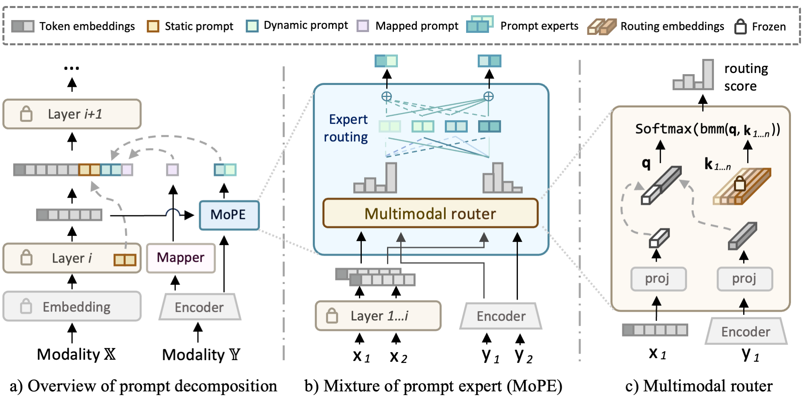
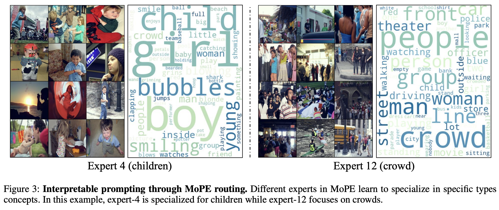

# MoPE: Parameter-Efficient and Scalable Multimodal Fusion via Mixture of Prompt Experts｜ [Arxiv](https://arxiv.org/abs/2403.10568)
Official Implementation of MoPE: Parameter-Efficient and Scalable Multimodal Fusion via Mixture of Prompt Experts

What is MoPE? MoPE is a prompt-based method to fuse unimodal pretrained models (e.g., ViT, Bert) for downstream multimodal tasks. MoPE is parameter-efficient and scalable, and achieves state-of-the-art performance on various multimodal tasks.

## MoPE Visualization

